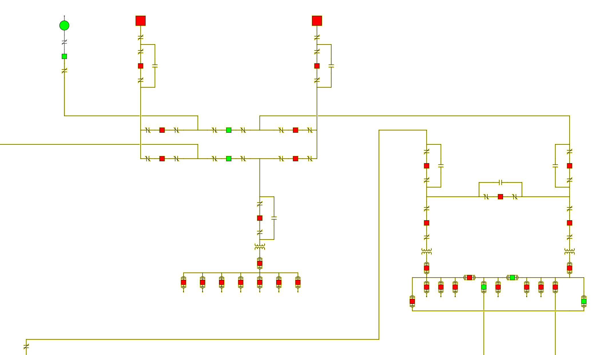

---
GridFlow is a power grid simulation focused on energy flow. This is a Cal Poly Capstone project in partnership with Vandenberg Air Force Base. 

## Install & Run
These instructions are for IntelliJ IDEA
1. Clone the repository.
2. Launch IntelliJ and choose open/import project. Pick the gridflow folder you just cloned.
3. Download the [JavaFX Windows SDK](https://gluonhq.com/products/javafx/).
4. Download the [Jackson API Jar Files](https://drive.google.com/file/d/1GhfWgj3reuj3PYdLCcUk4niAHKcEgayb/view?usp=sharing)
5. In IntelliJ, navigate to File > Project Structure > Libraries.
6. Click the + button and select Java. Select javafx-sdk-x.x.x/lib. Press Apply and OK.
7. Click the + button and select Java. Select folder with Jackson API Jar Files. Press Apply and OK.
8. Build the project.
9. Create a new Application runtime configuration. Name this gridflow and select application.GridFlowApp as the Main class.
10. Add this as VM options for the runtime configuration:
   >--module-path YOUR-PATH-TO-JAVAFX-SDK\lib --add-modules javafx.controls,javafx.fxml
11. Press Run.
